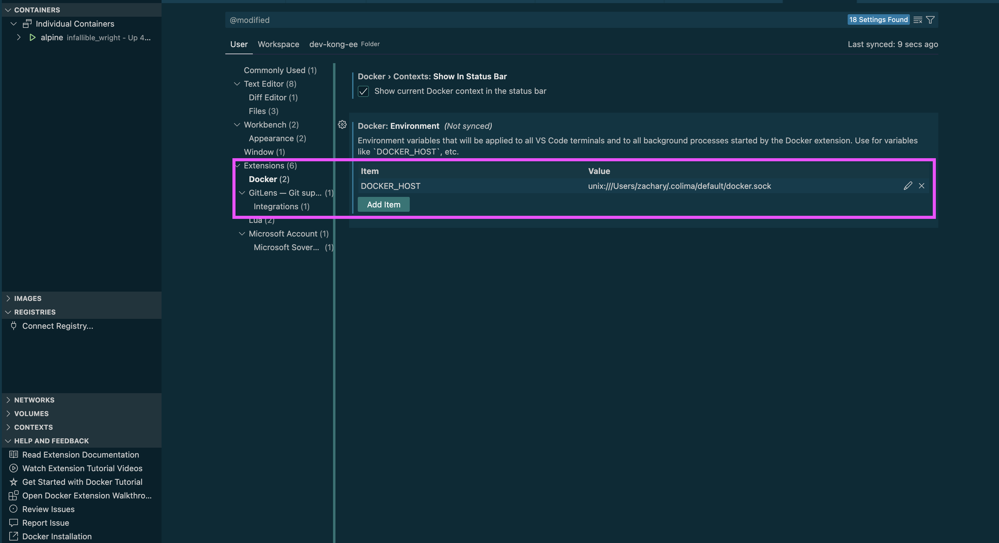

1. toc
{:toc}

As required by the company, we have to remove Docker Desktop from our macOS due to the pricing model change. After searching over the web, I found the [colima - container runtime](https://github.com/abiosoft/colima) a good alternative.

# Introduction #

*CoLiMa* stands for Containers on [Lima (Linux Virtual Machine)](https://github.com/lima-vm/lima). It [supports three types of container Engines](https://github.com/abiosoft/colima?tab=readme-ov-file#features), namely Docker, [pure containerd](https://containerd.io/), [Incus](https://linuxcontainers.org/incus). In this post, we focus on the Docker Engine.

To [put it simple](https://github.com/abiosoft/colima/blob/main/docs/FAQ.md), colima [creates a Linux Virtual Machine on macOS](/2018/04/21/docker-newbie/#docker-desktop) based on Lima and then serves as the [Docker Engine](/2018/04/21/docker-newbie/#docker-engine). In this post, we call it *colima engine*.

# Uninstall Docker Desktop #

Docker Desktop includes both the Docker CLI and Docker engine. After uninstallation, both components are removed, including images, containers, volumes, networks, etc.

Once completed, all Docker objects are gone, inlcuding containers! See <https://docs.docker.com/desktop/uninstall/>.

# colima Setup #

## Install colima ##

```bash
~ $ brew install colima
...

==> Installing dependencies for colima: lima
==> Installing colima dependency: lima
==> Downloading https://ghcr.io/v2/homebrew/core/lima/manifests/1.0.3
Already downloaded: /Users/jim/Library/Caches/Homebrew/downloads/1433d7017c4773c2360cdd9ae90a6bf68d86b93c83daac1ed445db685427e583--lima-1.0.3.bottle_manifest.json
==> Pouring lima--1.0.3.arm64_sonoma.bottle.tar.gz
🍺  /opt/homebrew/Cellar/lima/1.0.3: 107 files, 205.6MB
==> Installing colima
==> Pouring colima--0.8.1.arm64_sonoma.bottle.tar.gz
==> Caveats
Bash completion has been installed to:
  /opt/homebrew/etc/bash_completion.d

To start colima now and restart at login:
  brew services start colima
Or, if you don't want/need a background service you can just run:
  /opt/homebrew/opt/colima/bin/colima start -f
==> Summary
🍺  /opt/homebrew/Cellar/colima/0.8.1: 11 files, 5.7MB
==> Running `brew cleanup colima`...

...
```

Check version.

```bash
~ colima version
colima version 0.8.1
git commit: 96598cc5b64e5e9e1e64891642b91edc8ac49d16

runtime: docker
arch: aarch64
client: v27.4.1
server: v27.4.0

~ $ limactl --version
limactl version 1.0.3

~ $ qemu-img --version
-bash: qemu-img: command not found
```

Lima is a dependency of the colima, and hence it is also installed.

## colima profile ##

colima has an important concept of *profile*. Each profile represents the configuration arguments (e.g. CPU architecture) of the Linux virtual machine, namely a colima *instance*. The colima CLI has a global option `--profile, -p` that defines a new VM instance or refers to an existing VM instance. For example, we can create two profiles for `aarch64` and `x86_64` respectively. The default profile name is `default`.

The supported VM parameters can be found by `colima help start`. They can be resources (CPU/memory) constraints, CPU architecture (aarch64/x86_64), engines (`--runtime`), dns, etc. We can even forward environment variables on the host to the VM via `--env`.

In this post, the terms *profile*, *instance*, *colima VM* and *colima engine* could be used interchangeably.

## Config colima ##

The `$COLIMA_HOME` environment variable specifies the conifig directory. By default, it points to `$HOME/.colima`.

```bash
21:52:17 jim@Jims-MacBook-Pro ~
$ echo 'export COLIMA_HOME=$HOME/.colima' >> .bashrc

$ export COLIMA_HOME=$HOME/.colima
$ mkdir -p $COLIMA_HOME
```

We can preset the default config of a [profile](#colima-profile) using *colima template*. The config file of a profile is located at `${COLIMA_HOME}/_templates/<profile>.yaml`. Each CLI option has a corresponding field in this file with detailed explanation.

The default resources assigned to the Linux VM is 2 CPUs, 2 GiB memory and 100 GiB disk space. We want to increase the CPU and memory a bit. We also want want the `--vm-type` to be `vz` instead of `qemu`.

```bash
~ $ colima template -p default --editor nano
>cpu: 4
>memory: 8
>vmType: vz

~ $ less ~/.colima/_templates/default.yaml
```

We can customize the config with the `--edit` CLI option upon start (`colima start`) or manually edit the `${COLIMA_HOME}/<profile>/colima.yaml` file. For example, the name and hostname of the colima VM of the `default` profile is `colima`. It can be customized the `hostname` field.

See [Can config file be used instead of cli flags?](https://github.com/abiosoft/colima/blob/main/docs/FAQ.md#can-config-file-be-used-instead-of-cli-flags).

## Start colima ##

List existing instances.

```bash
~ $ colima list
WARN[0000] No instance found. Run `colima start` to create an instance.
PROFILE    STATUS    ARCH    CPUS    MEMORY    DISK    RUNTIME    ADDRESS
```

[Start an instance](https://github.com/abiosoft/colima?tab=readme-ov-file#usage).

```bash
~ $ colima status -p default
FATA[0000] colima is not running

~ $ colima start -p default
```

Check the status. The colima instance exposes a [Docker Unix socket file docker.sock](#unix-socket-file) to the macOS host for local usage.

```bash
~ $ colima list
PROFILE    STATUS     ARCH       CPUS    MEMORY    DISK      RUNTIME    ADDRESS
default    Running    aarch64    4       8GiB      100GiB    docker

~ $ colima status -p default
INFO[0000] colima is running using macOS Virtualization.Framework
INFO[0000] arch: aarch64
INFO[0000] runtime: docker
INFO[0000] mountType: sshfs
INFO[0000] socket: unix:///Users/jim/.colima/default/docker.sock
```

Once started, a new [Docker context](#switch-docker-engine) *colima* and a new [Docker builder](#switch-docker-engine) *colima* are created and used. The name *colima* can be customized in the [config file](#config-colima). If the [DOCKER_HOST environment variable is set](#unix-socket-file), it would [override the colima context](#unix-socket-file) regardless of the `DOCKER_CONTEXT` value.

```bash
~ $ docker context list
NAME       DESCRIPTION                               DOCKER ENDPOINT                                     ERROR
colima *   colima                                    unix:///Users/jim/.colima/default/docker.sock
default    Current DOCKER_HOST based configuration   unix:///var/run/docker.sock
```

We can also make use of *brew services* to start colima. But currently, it does not support the `--profile, -p` CLI option. What is worse, it [can not create the docker context](https://github.com/abiosoft/colima/issues/1234)! The advantage of *brew services start* is it would regiester the service and autostart at system booting.

```bash
# take around 30s
~ $ brew services run/start colima
```

## Inspect colima ##

After the colima VM is created, a SSH config entry is inserted to `${COLIMA_HOME}/ssh_config`. Additionally, this entry is also inserted to the macOS SSH config.

```bash
~ $ less ${COLIMA_HOME}/ssh_config

~ $ head ~/.ssh/config
Include /Users/jim/.colima/ssh_config
```

So, we can get into the VM via *ssh*. Please check the [config file](#config-colima) for the *hostname*.

```bash
~ $ ssh <hostname>
# -or-
~ $ ssh -F ${COLIMA_HOME}/ssh_config <hostname>
```

Alternatively, colima provides the *ssh* sub-command accepting the profile name.

```bash
~ $ colima ssh -p default
```

From the output below, we found the VM OS is `Ubuntu 24.04`. Please check the `diskImage` filed in the [config file](#config-colima).

```bash
~ $ ssh colima
Last login: Tue Dec 31 11:54:26 2024 from 192.168.5.2

jim@colima:~$ pwd
/home/jim.linux

jim@colima:~$ id
uid=501(jim) gid=1000(jim) groups=1000(jim),991(docker)

jim@colima:~$ uname -a
Linux colima 6.8.0-50-generic #51-Ubuntu SMP PREEMPT_DYNAMIC Sat Nov  9 18:03:35 UTC 2024 aarch64 aarch64 aarch64 GNU/Linux
jim@colima:~$ cat /etc/os-release
PRETTY_NAME="Ubuntu 24.04.1 LTS"
NAME="Ubuntu"
VERSION_ID="24.04"
VERSION="24.04.1 LTS (Noble Numbat)"
VERSION_CODENAME=noble
ID=ubuntu
ID_LIKE=debian
HOME_URL="https://www.ubuntu.com/"
SUPPORT_URL="https://help.ubuntu.com/"
BUG_REPORT_URL="https://bugs.launchpad.net/ubuntu/"
PRIVACY_POLICY_URL="https://www.ubuntu.com/legal/terms-and-policies/privacy-policy"
UBUNTU_CODENAME=noble
LOGO=ubuntu-logo
```

By default, the user home directory is bind mounted to the colima VM.

```bash
~ $ jim@colima:~$ mount | grep Users
:/Users/jim on /Users/jim type fuse.sshfs (rw,nosuid,nodev,relatime,user_id=501,group_id=1000,allow_other)

jim@colima:~$ ls -l /Users/
total 4
drwxr-x--- 1 jim dialout 2144 Dec 31 22:44 jim
```

The [dockerd, containerd, containerd-shim and runc](/2018/04/21/docker-newbie/#architecture) all reside within the VM. The default pathname of [Docker Unix socket docker.sock](dockersock) is located within the colima VM but [mapped](#start-colima) to the macOS host.

```bash
jim@colima:~$ ps -eF --forest | grep [c]ontainerd
root         446       1  0 465190 40872  1 13:58 ?        00:00:11 /usr/bin/containerd
root        1218       1  0 546591 71184  2 13:58 ?        00:00:03 /usr/bin/dockerd -H fd:// --containerd=/run/containerd/containerd.sock --host-gateway-ip=192.168.5.2

jim@colima:~$ ls -l /var/run/docker.sock
srw-rw---- 1 root docker 0 Dec 31 11:39 /var/run/docker.sock
```

## Update colima ##

When it comes to "update colima", we mean updating either the whole colima or just the runtime part.

1. To just update the runtime part, we just run `colima update -p <profile>`.
2. To update the whole colima (runtime included), refer to [Install colima](#install-colima).

Use `colima delete` to destroy everything similar to a fresh installation.

# Docker CLI Setup #

## Install Docker CLI ##

Install Docker CLI. Please do NOT add the `--cask` CLI option!

```bash
~ $ brew install docker docker-compose docker-buildx
```

Additionally, we install additional Docker plugins.

```bash
~ $ brew install docker-compose docker-buildx
```

## Config Docker CLI ##

Firstly, let us set the configuration directory via the [DOCKER_CONFIG](https://docs.docker.com/reference/cli/docker/#environment-variables) environment variable.

```bash
~ $ 17:12:05 jim@Jims-MacBook-Pro ~
$ echo 'export DOCKER_CONFIG=$HOME/.config/docker' >> ~/.bashrc

$ export DOCKER_CONFIG=${HOME}/.config/docker
$ mkdir -p $DOCKER_CONFIG
```

We configure the Docker CLI let it find the plugins.

```bash
~ $ 17:13:15 jim@Jims-MacBook-Pro ~
$ cat .config/docker/config.json
{
    "auths": {},
    "cliPluginsExtraDirs": [
        "/opt/homebrew/lib/docker/cli-plugins"
    ]
}
```

## Switch Docker Engine ##

In the [Start colima](#start-colima) section, the [Docker Context](#/2018/04/21/docker-newbie/#docker-context) and the [Docker builder](#multi-platform-build) are automatically switched to the colima Engine. But to definitely let Dokcer CLI communicate with the colima Engine, we should explicitly switch to it.

```bash
~ $ docker context use colima

~ $ docker buildx use colima 
```

# Verify Setup #

It is time that we create a container to verify the setup.

```bash
~ $ docker compose ls
NAME                STATUS              CONFIG FILES
16:29:49 jim@Jims-MacBook-Pro ~

~ $ docker ps
CONTAINER ID   IMAGE     COMMAND   CREATED   STATUS    PORTS     NAMES
```

From the output, an `aarch64` container was created. So, we can say the colima VM is also `aarch64`.

```bash
~ $ docker run --rm -ti alpine uname -a
Unable to find image 'alpine:latest' locally
latest: Pulling from library/alpine
cb8611c9fe51: Pull complete
Digest: sha256:21dc6063fd678b478f57c0e13f47560d0ea4eeba26dfc947b2a4f81f686b9f45
Status: Downloaded newer image for alpine:latest
Linux 12025f4e1ef2 6.8.0-50-generic #51-Ubuntu SMP PREEMPT_DYNAMIC Sat Nov  9 18:03:35 UTC 2024 aarch64 Linux
```

# Compatibility Setup #

## Unix Socket File ##

From the [Start colima](#start-colima) section and the [Inspect colima](#inspect-colima) section, we know the [Docker Unix socket docker.sock](/2018/04/21/docker-newbie/#dockersock) is mapped from the VM to the macOS host.

```
+---------------------------------------------------------------------------------------------------------------+
|                                                                                                               |
|                                                                                                               |
|    macOS Host                                                                                                 |
|                                                                                                               |
|                                                                                                               |
|        +-----------------------------------------------+                                                      |
|        |                                               |                                                      |
|        |   colima Engine                               |                                                      |
|        |                                               |                                                      |
|        |                                               |                                                      |
|        |     dockerd containerd containerd-shim runc   |                                                      |
|        |                                               |                                                      |
|        |                                               |                                                      |
|        |         unix:///var/run/docker.sock      -----+---> unix:///Users/jim/.colima/default/docker.sock    |
|        |                                               |                                                      |
|        +-----------------------------------------------+                                                      |
|                                                                                                               |
|                                                                                                               |
+---------------------------------------------------------------------------------------------------------------+
```

Applications can not find the colima engine as they assume the default pathname `/var/run/docker.sock`. We should set `DOCKER_HOST` and/or `DOCKER_CONTEXT` [Docker environment variables](https://docs.docker.com/reference/cli/docker/#environment-variables) to the *colima engine*.

Take VSCode for example, we can set the variables in the [Docker extension](https://code.visualstudio.com/remote/advancedcontainers/develop-remote-host#_connect-using-docker-contexts).



For CLI applications, here is an example.

```bash
~ $ DOCKER_HOST="unix://${COLIMA_HOME}/default/docker.sock" docker context ls
NAME        DESCRIPTION                               DOCKER ENDPOINT                                     ERROR
colima      colima                                    unix:///Users/jim/.colima/default/docker.sock
default *   Current DOCKER_HOST based configuration   unix:///Users/jim/.colima/default/docker.sock
Warning: DOCKER_HOST environment variable overrides the active context. To use a context, either set the global --context flag, or unset DOCKER_HOST environment variable.

~ $ DOCKER_HOST="unix://${COLIMA_HOME}/default/docker.sock" docker buildx ls
NAME/NODE     DRIVER/ENDPOINT   STATUS    BUILDKIT   PLATFORMS
colima        docker
 \_ colima     \_ colima        running   v0.17.3    linux/amd64 (+2), linux/arm64, linux/386
default*      docker
 \_ default    \_ default       running   v0.17.3    linux/amd64 (+2), linux/arm64, linux/386
```

See [FAQ Cannot connect to the Docker daemon](https://github.com/abiosoft/colima/blob/main/docs/FAQ.md#cannot-connect-to-the-docker-daemon-at-unixvarrundockersock-is-the-docker-daemon-running).

## Multi-platform Build ##

The default [docker build driver](https://docs.docker.com/build/builders/drivers/) prioritizes simplicity but does not support advanced features like [multi-platform build](https://docs.docker.com/build/building/multi-platform/), caching, etc.

```bash
~ $ docker buildx ls
NAME/NODE    DRIVER/ENDPOINT   STATUS    BUILDKIT   PLATFORMS
colima*      docker
 \_ colima    \_ colima        running   v0.17.3    linux/amd64 (+2), linux/arm64, linux/386
```

To support multi-platform build, create a builder with the [docker-container build driver](https://docs.docker.com/build/builders/drivers/) that has multi-platform support. This driver would create a dedicated container as the builder backend.

The `--use` option would switch to the newly created builder, while `--bootstrap` would start the dedicated container in advanced.

```bash
~ $ docker buildx create --use --bootstrap --name multi-platform-builder --node multi-platform-builder --driver docker-container --platform "linux/arm64,linux/amd64"
[+] Building 4.4s (1/1) FINISHED
 => [internal] booting buildkit                                                                                                                                                                                               4.4s
 => => pulling image moby/buildkit:buildx-stable-1                                                                                                                                                                            4.0s
 => => creating container buildx_buildkit_multi-platform-builder                                                                                                                                                              0.4s
multi-platform-builder

~ $ docker buildx ls
NAME/NODE                    DRIVER/ENDPOINT    STATUS    BUILDKIT   PLATFORMS
multi-platform-builder*      docker-container
 \_ multi-platform-builder    \_ colima         running   v0.18.2    linux/amd64* (+2), linux/arm64*, linux/386
colima                       docker
 \_ colima                    \_ colima         running   v0.17.3    linux/amd64 (+2), linux/arm64, linux/386

~ $ docker ps
CONTAINER ID   IMAGE                           COMMAND                  CREATED          STATUS          PORTS     NAMES
80b4fa8ad380   moby/buildkit:buildx-stable-1   "buildkitd --allow-i…"   14 seconds ago   Up 14 seconds             buildx_buildkit_multi-platform-builder
```

Let's build a "linux/amd64" image on the "linux/arm64" machine.

```bash
~ $ grep -A1 platforms kong-dev-compose.yaml
72:      platforms:                    # Docker will determine the native platform unless you specify a different value.
73-      - "linux/amd64"               # linux/arm64 | linux/amd64

~ $ $ docker compose -f kong-dev-compose.yaml build kong
[+] Building 0/1s (0/1)                                                                                                                                                                           docker-container:multi-platform-builder
[+] Building 59.2s (7/16)                                                                                                                                                                         docker-container:multi-platform-builder
[+] Building 93.9s (7/16)                                                                                                                                                                         docker-container:multi-platform-builder
 => [kong internal] booting buildkit                                                                                                                                                                                                 3.3s
 => => pulling image moby/buildkit:buildx-stable-1                                                                                                                                                                                   2.9s
 => => creating container buildx_buildkit_multi-platform-builder                                                                                                                                                                     0.4s
 => [kong internal] load build definition from kong-dev-compose.Dockerfile                                                                                                                                                           0.0s
 => => transferring dockerfile: 6.34kB                                                                                                                                                                                               0.0s
 => [kong internal] load metadata for docker.io/library/ubuntu:24.04                                                                                                                                                                 4.3s
 => [kong auth] library/ubuntu:pull token for registry-1.docker.io                                                                                                                                                                   0.0s
 => [kong internal] load .dockerignore                                                                                                                                                                                               0.0s
 => => transferring context: 2B                                                                                                                                                                                                      0.0s
 => [kong emmyluadebugger 1/2] FROM docker.io/library/ubuntu:24.04@sha256:80dd3c3b9c6cecb9f1667e9290b3bc61b78c2678c02cbdae5f0fea92cc6734ab                                                                                           1.9s
 => => resolve docker.io/library/ubuntu:24.04@sha256:80dd3c3b9c6cecb9f1667e9290b3bc61b78c2678c02cbdae5f0fea92cc6734ab                                                                                                                0.0s
 => => sha256:8bb55f0677778c3027fcc4253dc452bc9c22de989a696391e739fb1cdbbdb4c2 28.89MB / 28.89MB                                                                                                                                     1.4s
 => => extracting sha256:8bb55f0677778c3027fcc4253dc452bc9c22de989a696391e739fb1cdbbdb4c2                                                                                                                                            0.5s
 => [kong emmyluadebugger 2/2] RUN <<-EOF (set -ex...)                                                                                                                                                                              84.0s
 => => # [ 68%] Building CXX object emmy_debugger/CMakeFiles/emmy_debugger.dir/src/transporter/transporter.cpp.o
 => => # [ 70%] Building CXX object emmy_debugger/CMakeFiles/emmy_debugger.dir/src/debugger/emmy_debugger.cpp.o
 => => # [ 71%] Building CXX object emmy_debugger/CMakeFiles/emmy_debugger.dir/src/debugger/emmy_debugger_manager.cpp.o
 => => # [ 73%] Building CXX object emmy_debugger/CMakeFiles/emmy_debugger.dir/src/debugger/emmy_debugger_lib.cpp.o
 => => # [ 75%] Building CXX object emmy_debugger/CMakeFiles/emmy_debugger.dir/src/debugger/hook_state.cpp.o
 => => # [ 76%] Building CXX object emmy_debugger/CMakeFiles/emmy_debugger.dir/src/debugger/extension_point.cpp.o
 => [kong baseimage  2/11] RUN echo "I am building target platform linux/amd64 on source platform linux/arm64 from base ubuntu:24.04"

...

~ $ docker image inspect 11e108b7f310
...
"Architecture": "amd64",
```

Please see [multi-platform-docker-build](https://github.com/BretFisher/multi-platform-docker-build).

# References #

1. [colima FAQ](https://github.com/abiosoft/colima/blob/main/docs/FAQ.md).
